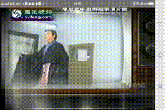
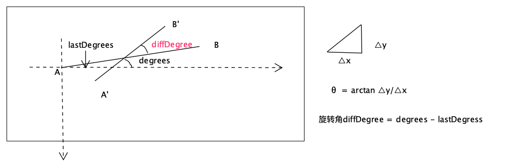

# VideoTouchScaleRotate
视频播放画面双指旋转、缩放、平移以及回弹动效实现

[toc]

文章索引
1. [Android 视频手势缩放与回弹动效实现（一）](https://github.com/yinxuming/VideoTouchScale/blob/master/README.md)：主要是实现视频双指：缩放、平移、回弹动效
1. [Android 视频旋转、缩放与回弹动效实现（二）](https://github.com/yinxuming/VideoTouchScaleRotate/blob/main/README.md)：主要是实现视频双指：**旋转**、缩放、平移、回弹动效

# Android 视频旋转、缩放与回弹动效实现（二）

在[Android 视频手势缩放与回弹动效实现（一）](https://github.com/yinxuming/VideoTouchScale/blob/master/README.md)中我们实现了下列1-5部分的需求，事实上对于双指手势触摸，不仅可以缩放、平移，还可以进行**旋转**，现在我们就在原有基础上进行改造，添加**视频手势旋转**及**回弹动效**，来实现需求6。
# 功能需求

1. 双指缩放视频播放画面，支持设定最小、最大缩放范围
2. 双指拖动画面可任意方向移动
3. 如果是缩小画面，最后需要在屏幕居中显示，并且需要有动画效果
4. 如果是放大画面，有画面边缘在屏幕内的，需要自动吸附到屏幕边缘
5. 视频暂停状态下也能缩放
6. 双指旋转画面，旋转角度以45度为分界线，进行自动校正（超过45度旋转90度；不超过45度旋转0度）

# 实现思路
实现主要思路
1. 手势旋转识别。
   接收onTouchEvent事件，识别双指旋转：旋转角度、旋转中心
2. 手势旋转处理。
   识别到手势旋转后，通过`Matrix.postRotate`进行画面旋转变换
3. 缩放倍数逻辑改造。
   由于旋转也会引起`Matrix#MSCALE_X`值发生变化，缩放倍数不能再通过直接获取矩阵该分量值来计算，需要将计算后的缩放倍数独立保存。参考：[Android Matrix 带你掌控雷电](https://www.jianshu.com/p/b8cc4ac9780b)，旋转部分对`Matrix`的影响
4. 回弹动效触发。
   原有回弹动效是在缩放结束后`onScaleEnd`触发，加入旋转后，需要保证在缩放结束`onScaleEnd`和旋转结束`onRotateEnd`后才触发，这里选择`ACTION_UP`来触发回弹动效。
5. 回弹动效的计算。
   加入旋转后，回弹动效在原有2个数据：`transAnimX`、`transAnimY`（x、y轴上的平移补偿）基础上增加了旋转补偿角度`rotateEndFixDegrees`。

## 1. 旋转识别
在缩放、平移中我们使用系统自带缩放识别类`ScaleGestureDetector.onTouchEvent(event)`来识别当前触摸事件，得到`onScaleBegin`、`onScale`、`onScaleEnd`的缩放回调，然后用`VideoTouchScaleHandler`来对缩放、平移进行相应处理。

加入旋转功能后，由于系统**没有自带旋转识别类**，我们需要自定义实现手势识别旋转：`RotateGestureDetector`。下面介绍`RotateGestureDetector`里面的主要逻辑，即如何识别**旋转中心**与**旋转角度**。
1. **旋转中心**
   旋转中心计算比较简单，通过获取**双指间连线的中心点**即可。
   但是实际我们在视频画面旋转中，**不会使用双指中心**来进行旋转，而是直接**使用画面中心**来旋转，为什么呢？
   
   如果采用双指中心来旋转，因为每次旋转的中心点都不固定，会造成旋转时，**变换矩阵中的位移分量**也受到了影响，这样后续在计算回弹动效的时候，需要补偿的位移`transAnimX`、`transAnimY`会因为**旋转中心点**的**变化**，而**无法**准确**计算**出。
   ```java
    // 计算双指旋转中心点
    float pivotX = (event.getX(0) + event.getX(1)) / 2;
    float pivotY = (event.getY(0) + event.getY(1)) / 2;

    // 实际播放画面的旋转中心为画面中心点
    mRotateCenter = new PointF(mTouchAdapter.getTextureView().getWidth() / 2,
                    mTouchAdapter.getTextureView().getHeight() / 2);
   ```
   
2. **旋转角度**
   旋转角度的计算稍微比较复杂，我们需要先计算**当前双指连线的夹角degrees**, 来**减去上一次我们记录的手指连线夹角lastDegrees**，才能得到本次旋转的角度**diffDegree = degrees - lastDegrees**。如图所示：
   



双指连线夹角`degrees`如何计算呢？

   这里我们需要获取到双指分别在x、y轴上的分量$\Delta x, \Delta y$，组成的三角形，由于$tan(\theta)=\frac{\Delta y}{\Delta x}$通过计算夹角的反正切三角函数arctangent得到偏移角度$\theta=arctan \frac{\Delta y}{\Delta x}$。几个注意的小点：

   1. `Math.atan2(y, x)`和`Math.atan(v)`差异。

      都能计算反正切，为了**避免除数为0**的情况（当然还有其它差别，如结果范围不同），我们一般选用`Math.atan2(y, x)`

   2. `Math.atan2(y, x)`结果。

      计算结果值为**弧度**，取值范围**[-Math.PI, Math.PI]**，由于旋转操作`Matrix.postRotate`传入的参数为具体角度，所以我们需要将**弧度**通过`Math.toDegrees`转换为**角度** [-180, 180]。

   3. 分母**微小抖动**带来的**角度剧烈变化**。

      试想一下$\frac{\Delta y}{\Delta x}$，当$\Delta y$一定情况下，$\Delta x$轴偏移量稍微变化点点，都会引起角度剧烈变化，显然不符合用户的真实意图，所以对于超过45度的变化，我们可以认为只改变少许角度，这里取值正负5度。

   4. 旋转角度`diffDegree`>0，则通过`Matrix.postRotate`传入角度进行旋转，结果为正数是**顺时针旋转**，否则是逆时针旋转

   ```java
    // 计算双指旋转中心，使手势识别工具类具备识别旋转中心能力，但本次需求实际并不会使用，而是始终用画面中心来旋转
    float pivotX = (event.getX(0) + event.getX(1)) / 2;
    float pivotY = (event.getY(0) + event.getY(1)) / 2;
 float deltaX = event.getX(0) - event.getX(1);
    float deltaY = event.getY(0) - event.getY(1);
    float degrees = (float) Math.toDegrees(Math.atan2(deltaY, deltaX));
   
    // 计算本次旋转角度
    float diffDegree = degrees - mLastDegrees;  // 旋转角度 = 当前双指夹角 - 上次双指夹角。结果大于0 顺时针旋转；小于0逆时针旋转
    if (diffDegree > 45) {  // y/x 分母微小抖动带来的角度剧烈变化，修正
        diffDegree = -5;
    } else if (diffDegree < -45) {
     diffDegree = 5;
    }
   ```
   下面是旋转识别类`RotateGestureDetector`的所有源码
### 旋转识别：RotateGestureDetector
```java
/**
 * 手势旋转识别
 * <p>
 *
 * @author yinxuming
 * @date 2020/12/22
 */
public class RotateGestureDetector {

    private OnRotateGestureListener mRotateGestureListener;
    private boolean mIsRotate = false;
    private float lastDegrees;


    public boolean onTouchEvent(MotionEvent event) {
        if (event.getPointerCount() != 2) {
            mIsRotate = false;
            return false;
        }
        float pivotX = (event.getX(0) + event.getX(1)) / 2;
        float pivotY = (event.getY(0) + event.getY(1)) / 2;
        float deltaX = event.getX(0) - event.getX(1);
        float deltaY = event.getY(0) - event.getY(1);
        float degrees = (float) Math.toDegrees(Math.atan2(deltaY, deltaX)); // 当前双指连线夹角

        switch (event.getActionMasked()) {
            case MotionEvent.ACTION_DOWN:
            case MotionEvent.ACTION_POINTER_DOWN:
                lastDegrees = degrees;
                mIsRotate = false;
                break;
            case MotionEvent.ACTION_MOVE:
                if (!mIsRotate) {
                    mIsRotate = true;
                    notifyRotateBegin();
                }
                float diffDegree = degrees - lastDegrees;  // 旋转角度 = 当前双指夹角 - 上次双指夹角。结果大于0 顺时针旋转；小于0逆时针旋转
                if (diffDegree > 45) { // y/x 分母微小抖动带来的角度剧烈变化，修正
                    diffDegree = -5;
                } else if (diffDegree < -45) {
                    diffDegree = 5;
                }
                notifyRotate(diffDegree, pivotX, pivotY);
                lastDegrees = degrees;
                break;
            case MotionEvent.ACTION_POINTER_UP:
            case MotionEvent.ACTION_CANCEL:
                lastDegrees = 0;
                mIsRotate = false;
                notifyRotateEnd();
                break;
        }

        return true;
    }

    private void notifyRotateBegin() {
        if (mRotateGestureListener != null) {
            mRotateGestureListener.onRotateBegin(this);
        }
    }

    private void notifyRotate(float diffDegree, float pivotX, float pivotY) {
        if (mRotateGestureListener != null) {
            mRotateGestureListener.onRotate(this, diffDegree, pivotX, pivotY);
        }
    }

    private void notifyRotateEnd() {
        if (mRotateGestureListener != null) {
            mRotateGestureListener.onRotateEnd(this);
        }
    }

    public void setRotateGestureListener(OnRotateGestureListener rotateGestureListener) {
        mRotateGestureListener = rotateGestureListener;
    }

    public interface OnRotateGestureListener {
        boolean onRotateBegin(RotateGestureDetector detector);

        boolean onRotate(RotateGestureDetector detector, float degrees, float px, float py);

        void onRotateEnd(RotateGestureDetector detector);
    }

    public static class SimpleOnRotateGestureListener implements OnRotateGestureListener {

        @Override
        public boolean onRotateBegin(RotateGestureDetector detector) {
            return false;
        }

        @Override
        public boolean onRotate(RotateGestureDetector detector, float degrees, float px, float py) {
            return false;
        }


        @Override
        public void onRotateEnd(RotateGestureDetector detector) {

        }
    }
}
```

## 2. 旋转处理
旋转处理，我们通过`VideoTouchRotateHandler`来进行旋转处理。主要功能是实现旋转识别`RotateGestureDetector.OnRotateGestureListener`的接口，然后注册到旋转识别工具中`RotateGestureDetector`，来接收旋转识别结果。

最后使用`Matrix.postRotate(degrees, px, py)`来对画面进行旋转。几个注意点：

1. `Matrix.postRotate(degrees, px, py)`与`Matrix.postRotate(degrees)`区别。
   不带旋转中心参数的方法，默认旋转中心是控件本身**左上角**，所以我们必须使用带旋转中心参数的方法，设置旋转中心为`TextureView`中心点位置。
2. **累计**旋转角度**误差**处理。
   累计旋转角度超过360，我们需要对其**取模**转换，避免**旋转角度误差持续累加**，导致画面定位不准。` rotateDegrees = rotateDegrees % 360`。
3. `Matrix`同步更新。
   旋转处理`VideoTouchRotateHandler`使用的变换矩阵`Matrix`，如何与缩放处理`VideoTouchScaleHandler`里面使用的`Matrix`，进行同步更新？

   直接使用`matrix = textureVie.getTransform(null)`，就能获取到当前视频画面的变换矩阵，无论是缩放还是旋转，显然都是对同一个`TextureView`来操作的，所以获取到是最新的值。这里有一个容易出错点，~~使用`view.getMatrix`来获取`Matrix`~~。
   
   当然根据实际需求，也可以自己缓存`Matrix`，只要能保证缩放和旋转同时获取到的是最新的`Matrix`，并且能实时更新`Matrix`给对方即可。
4. 旋转结束后补偿角度`rotateEndFixDegrees`的计算。
   ```java
    /**
     * 计算旋转结束后需要补偿的角度
     * @param currentRotateDegree
     * @return
     */
    public static float computeRoteEndDegree(float currentRotateDegree) {
        float rotateEndFixDegrees = currentRotateDegree % 90;
        if (rotateEndFixDegrees != 0) {
            if (rotateEndFixDegrees >= 45) { // 大于45度，直接旋转到90，计算旋转到90需要的角度
                rotateEndFixDegrees = 90 - rotateEndFixDegrees;
            } else if (rotateEndFixDegrees > -45 && rotateEndFixDegrees < 45) { // (-45, 45)，回弹到0度位置
                rotateEndFixDegrees = -rotateEndFixDegrees;
            } else if (rotateEndFixDegrees < -45) { // 小于-45，直接旋转到-90，计算旋转到90需要的角度
                rotateEndFixDegrees = -90 - rotateEndFixDegrees;
            }
        }
        return rotateEndFixDegrees;
    }
   ```
5. 旋转回弹动效结束后，更新实际角度位置。
   旋转结束后，需要补偿旋转角度`rotateEndFixDegrees`的，进行回弹动画，确保画面始终处于90度倍数位置，动画完成后，更新以前记录的旋转角度`VideoTouchRotateHandler#mRotateDegrees`

### 旋转处理：VideoTouchRotateHandler
```java
/**
 * 手势旋转 处理
 * <p>
 *
 * @author yinxuming
 * @date 2020/12/23
 */
public class VideoTouchRotateHandler implements IVideoRotateHandler, RotateGestureDetector.OnRotateGestureListener {
    private static final String TAG = "VideoTouchRotateHandler";

    private IVideoTouchAdapter mTouchAdapter;
    private boolean mIsRotating;  // 是否旋转中
    private float mRotateDegrees;
    private PointF mRotateCenter;   // 目前需求只需要围绕画面中心旋转即可

    public VideoTouchRotateHandler(IVideoTouchAdapter videoTouchAdapter) {
        mTouchAdapter = videoTouchAdapter;
    }

    @Override
    public boolean onRotateBegin(RotateGestureDetector detector) {
         if (isTextureViewValid()) {
            mTouchAdapter.getVideoTouchEndAnim().endPrevAnim();
            mIsRotating = true;
            mRotateCenter = new PointF(mTouchAdapter.getTextureView().getWidth() / 2,
                    mTouchAdapter.getTextureView().getHeight() / 2);
        }
        return true;
    }

    @Override
    public boolean onRotate(RotateGestureDetector detector, float degrees, float px, float py) {
        if (isRotating()) {
            postRotate(degrees); // 永远使用画面中心点进行旋转，避免由于旋转中心点引起位置变化，最后的回弹动效无法与边缘对齐
        }
        return true;

    }

    private void postRotate(float rotateDegree) {
        Matrix matrix = getTransformMatrix();
        matrix.postRotate(rotateDegree, mRotateCenter.x, mRotateCenter.y);
        updateMatrixToTexture(matrix);
        setRotateDegrees(getCurrentRotateDegree() + rotateDegree);
    }


    @Override
    public void onRotateEnd(RotateGestureDetector detector) {
        LogUtil.e(TAG, "onRotateEnd " + mRotateDegrees);
        if (isRotating() && mTouchAdapter.getVideoTouchEndAnim() != null) {
            mTouchAdapter.getVideoTouchEndAnim().setEndAnimRotate(getCurrentRotateDegree(),
                    computeRoteEndDegree(getCurrentRotateDegree()));
        }
        mIsRotating = false;
    }

    public boolean isRotating() {
        return mIsRotating;
    }

    @Override
    public boolean isRotated() {
        return mRotateDegrees != 0 || mIsRotating;
    }

    @Override
    public float getCurrentRotateDegree() {
        return mRotateDegrees;
    }

    private void setRotateDegrees(float rotateDegrees) {
        rotateDegrees = rotateDegrees % 360; // 大于360度的，取其模，避免累加误差急剧增大
        mRotateDegrees = rotateDegrees;

    }

    @Override
    public float getTargetRotateDegree() {
        return getCurrentRotateDegree() + computeRoteEndDegree(getCurrentRotateDegree());
    }

    /**
     * 旋转回弹动画结束后，更新已补偿的角度
     * @param rotateDegree
     */
    @Override
    public void fixRotateEndAnim(float rotateDegree) {
        setRotateDegrees(getCurrentRotateDegree() + rotateDegree);
    }

    @Override
    public void cancelRotate() {
        setRotateDegrees(0);
        mRotateCenter = null;
    }

    private boolean isTextureViewValid() {
        return mTouchAdapter.getTextureView() != null && mTouchAdapter.getTextureView().isAvailable();
    }

    private Matrix getTransformMatrix() {
        if (isTextureViewValid()) {
            return mTouchAdapter.getTextureView().getTransform(null);
        }
        return null;
    }

    private void updateMatrixToTexture(Matrix newMatrix) {
        if (isTextureViewValid()) {
            TextureView textureView = mTouchAdapter.getTextureView();
            textureView.setTransform(newMatrix);
            if (!mTouchAdapter.isPlaying()) {
                textureView.invalidate();
            }
        }
    }

    /**
     * 计算旋转结束后需要补偿的角度
     * @param currentRotateDegree
     * @return
     */
    public static float computeRoteEndDegree(float currentRotateDegree) {
        float rotateEndFixDegrees = currentRotateDegree % 90;
        if (rotateEndFixDegrees != 0) {
            if (rotateEndFixDegrees >= 45) { // 大于45度，直接旋转到90，计算旋转到90需要的角度
                rotateEndFixDegrees = 90 - rotateEndFixDegrees;
            } else if (rotateEndFixDegrees > -45 && rotateEndFixDegrees < 45) { // (-45, 45)，回弹到0度位置
                rotateEndFixDegrees = -rotateEndFixDegrees;
            } else if (rotateEndFixDegrees < -45) { // 小于-45，直接旋转到-90，计算旋转到90需要的角度
                rotateEndFixDegrees = -90 - rotateEndFixDegrees;
            }
        }
        return rotateEndFixDegrees;
    }

}
```
## 3. 回弹动效

整个视频手势缩放、旋转、位移最难处理的部分，应该就是计算回弹动效了。实现回弹动效主要有两种思路：

1. 回弹动效思路一
    已知当前画面的位置`startAnimMatrix`，要进行回弹动效到最终位置，主要做了2类操作，**位移**和**旋转**，也就是我们只需要计算出**位移补偿**和**旋转角度补偿**，就可以构造属性动画，进行线性渐变位移与旋转。实际在使用时，该方案有一些问题，缩小时不一定完全居中，推测可能是计算位移补偿时，是先进行旋转，再计算位移补偿，而实际使用时，动画是一边执行旋转，一边执行位移，导致位移的值不准确。
   
2. 回弹动效思路二
    这里还有一种思路，参考[自定义可旋转、平移、缩放的ImageView](https://www.jianshu.com/p/938ca88fb16a)或[PinchImageView](https://github.com/boycy815/PinchImageView/blob/master/pinchimageview/src/main/java/com/boycy815/pinchimageview/PinchImageView.java)。它的主要思路，也是已知`startAnimMatrix`，然后关注点变成直接去计算出**动效结束矩阵`endAnimMatrix`**，然后动画执行时去操作矩阵`Matrix`上9个分量的值，使`startAnimMatrix`最终达到`endAnimMatrix`。

这里我们主要按思路二进行回弹动效实现，需要解决以下几个问题:
1. 动效触发的时机
2. 动效参数计算：旋转补偿角度引起`transAnimX`、`transAnimY`的变化如何计算?
3. 如何处理连续动画：即本次动画还未执行完毕，下次动画已经到来，如何处理?

### 1. 动效触发时机
回弹动效的时机，原来是在缩放结束`onScaleEnd`后，现在需要同时保证在缩放结束后`onScaleEnd`和旋转结束后`onRotateEnd`执行。下面我们观察下`onTouchEvent`事件的回调顺序，可以得出结论，在`ACTION_UP`中触发回弹动效即可。
#### 双指触摸onTouchEvent回调顺序
通过观察事件触摸回调顺序，我们可以看到，只需要在`ACTION_UP`中触发回弹动效即可。
```java
int count = event.getPointerCount(); // 手指触摸点
int action = event.getActionMasked;  // 触摸动作
```
onTouchEvent双指触摸事件回调顺序：
| count |action | |
|--------| :----- | :----|
|1|ACTION_DOWN|单指按下|
|2|ACTION_POINTER_DOWN|第二只手指按下|
|2|ACTION_MOVE|触摸移动|
|2|ACTION_MOVE|
|...|...|
|2|ACTION_POINTER_UP|抬起其中一只手指触发：<br>onScaleEnd、onRotateEnd|
|1|ACTION_UP|抬起最后一只手指触发|


### 2. 动效参数计算
回弹动效参数主要涉及2类：
1. 旋转补偿：补偿角度`rotateEndFixDegrees`、旋转中心（画面中心），这个上面已经知道如何计算
2. 位移补偿：`transAnimX`、`transAnimY`


这里要解决的问题就是如何计算加入旋转后的位移补偿`transAnimX`、`transAnimY`？主要思路如下：
1. 旋转结束后，画面的变换矩阵`currentTransformMatrix = textureView.getTransform(null)`是已知的，这个相当于是回弹动效的起始位置`startAnimMatrix`
2. 要计算回弹动效结束位置矩阵`endAnimMatrix`，我们首先要对当前矩阵进行**旋转角度补偿**，即：`currentTransformMatrix.postRotate(fixDegrees, center.x, center.y)`，得到`endAnimMatrix`，此时画面的位置距离动画结束后的位置，差别就是：**位移补偿**，这时再计算`transAnimX`、`transAnimY`即可。
3. `transAnimX`、`transAnimY`计算，我们同缩放一样，先通过`endAnimMatrix.mapRect(rectF)`测量出上述旋转补偿后的矩形位置`currentLocationRectF`，然后对比视频`TextureView`所占屏幕矩形区域的`videoRectF`位置（全屏情况下就是**屏幕矩形区域**，下面描述简化为对屏幕的描述），则可以计算出位移补偿。

    下面以`transAnimX`计算为例，具体的算法是：
   
   1. 当变换后画面的宽度 < 屏幕宽度：画面**居中**。
   2. 当变换后画面左边界 在 屏幕内部：画面左边界**吸附**到屏幕**左边缘**
   3. 当变换后画面右边界 在 屏幕内部：画面右边界**吸附**到屏幕**右边缘**
   ```java
   if (currentLocationRectF.width() <= videoRectF.width()) { // 宽度 < 屏宽：居中
        transAnimX = videoRectF.right / 2 - (currentLocationRectF.right + currentLocationRectF.left) / 2;
    } else if (currentLocationRectF.left > videoRectF.left) { // 左侧在屏幕内：左移吸边
        transAnimX = videoRectF.left - currentLocationRectF.left;
    } else if (currentLocationRectF.right < videoRectF.right) {  //  右侧在屏幕内：右移吸边
        transAnimX = videoRectF.right - currentLocationRectF.right;
    }
   ```
`transAnimY`同理计算即可。

### 3. 连续回弹动效处理
动效的运行需要时间，如果上一次动效没有执行完毕，新的动效已经产生，我们该如何处理？

按照传统处理方式，我们需要执行`animtor.cancel()`。但是这里显然不能这么做，属性动画`ValueAnimotor.cancel`后，只会停留在当前位置，我们要的效果是，新动画准备好后，原有动画补偿的位移和角度都必须完成，即：**立即执行到结束位置**，这样才不至于影响新动画位置的计算。

这里我们直接使用`ValueAnimotor.end`就可以达到这个效果，调用后，它直接会**回调`onAnimationUpdate`结束值和`onAnimationEnd`**。
但使用的时候，需要**注意判断条件**，**启动后**的动画才能执行`end`，否则，动画结束后，调用`end`，**动画会重新运行一遍**：`onAnimationStart，onAnimationUpdate，onAnimationUpdate... onAnimationEnd`。

动画结束后，我们需要更新原有记录的旋转角度`VideoTouchRotateHandler#mRotateDegrees`为最终角度。`VideoTouchRotateHandler#fixRotateEndAnim`。

下面是动效的计算与执行的源码

### 回弹动效参数计算：VideoTouchFixEndAnim
```java

/**
 * 回弹动效参数计算、动画状态控制
 * <p>
 *
 * @author yinxuming
 * @date 2020/12/24
 */
public class VideoTouchFixEndAnim implements IVideoTouchEndAnim {

    private IVideoTouchAdapter mTouchAdapter;
    private ValueAnimator mAnimator;
    float mScale = 1.0f;
    float mCurrentRotateDegrees;
    float mRotateEndFixDegrees;
    boolean isNeedFixAnim = false;

    public VideoTouchFixEndAnim(IVideoTouchAdapter touchAdapter) {
        mTouchAdapter = touchAdapter;
    }

    @Override
    public void setEndAnimScale(float scale) {
        mScale = scale;
        isNeedFixAnim = true;
    }

    @Override
    public void setEndAnimRotate(float currentRotate, float rotateEndFixDegrees) {
        mCurrentRotateDegrees = currentRotate;
        mRotateEndFixDegrees = rotateEndFixDegrees;
        isNeedFixAnim = true;
    }

    @Override
    public void startAnim() {
        // 注意在主线程调用动画相关操作
        endPrevAnim();
        if (!isNeedFixAnim) {
            return;
        }
        mAnimator = makeFixEndAnimator();
        if (mAnimator == null) {
            return;
        }
        mAnimator.start();
    }


    @Override
    public void endPrevAnim() {
        if (mAnimator != null && (mAnimator.isRunning() || mAnimator.isStarted())) {
            mAnimator.end();
        }
        mAnimator = null;
    }

    /**
     * 计算transAnimX、transAnimY 得到endAnimMatrix，生成动画对象
     * @return
     */
    private ValueAnimator makeFixEndAnimator() {
        TextureView mTextureView = mTouchAdapter.getTextureView();
        // 动画 start矩阵：当前画面变换
        Matrix currentTransformMatrix = mTextureView.getTransform(null);
        Matrix endAnimMatrix = new Matrix();
        final float fixDegrees = mRotateEndFixDegrees;
        RectF videoRectF = new RectF(0, 0, mTextureView.getWidth(), mTextureView.getHeight());
        PointF center = new PointF(videoRectF.right / 2, videoRectF.bottom / 2);
        endAnimMatrix.set(currentTransformMatrix);
        // 动画 end矩阵：模拟计算当前画面经过旋转补偿后的矩阵
        endAnimMatrix.postRotate(fixDegrees, center.x, center.y);
        RectF currentLocationRectF = new RectF(0, 0, mTextureView.getWidth(), mTextureView.getHeight());
        // 测量画面最终应该进行的矩阵变换位置
        endAnimMatrix.mapRect(currentLocationRectF);

        float transAnimX = 0f;
        float transAnimY = 0f;
        if (currentLocationRectF.left > videoRectF.left
                || currentLocationRectF.right < videoRectF.right
                || currentLocationRectF.top > videoRectF.top
                || currentLocationRectF.bottom < videoRectF.bottom) { //，有一边缩放后在屏幕内部，自动吸附到屏幕边缘 或 居中

            if (currentLocationRectF.width() <= videoRectF.width()) { // 宽度 < 屏宽：居中
                transAnimX = videoRectF.right / 2 - (currentLocationRectF.right + currentLocationRectF.left) / 2;
            } else if (currentLocationRectF.left > videoRectF.left) { // 左侧在屏幕内：左移吸边
                transAnimX = videoRectF.left - currentLocationRectF.left;
            } else if (currentLocationRectF.right < videoRectF.right) {  //  右侧在屏幕内：右移吸边
                transAnimX = videoRectF.right - currentLocationRectF.right;
            }

            if (currentLocationRectF.height() <= videoRectF.height()) { // 高度 < 屏搞：居中
                transAnimY = videoRectF.bottom / 2 - (currentLocationRectF.bottom + currentLocationRectF.top) / 2;
            } else if (currentLocationRectF.top > videoRectF.top) {  // 上移吸边
                transAnimY = videoRectF.top - currentLocationRectF.top;
            } else if (currentLocationRectF.bottom < videoRectF.bottom) { // 下移吸边
                transAnimY = videoRectF.bottom - currentLocationRectF.bottom;
            }
        }

        endAnimMatrix.postTranslate(transAnimX, transAnimY);

        // 不使用动画直接变换
//        mTouchAdapter.getTextureView().setTransform(endAnimMatrix);
//        mTouchAdapter.getVideoRotateHandler().postRotateDegrees(fixDegrees, false);
        if (transAnimX == 0 && transAnimY == 0 && fixDegrees == 0) {
            return null;
        } else {
            ScaleRotateEndAnimator animator = new ScaleRotateEndAnimator() {
                @Override
                protected void updateMatrixToView(Matrix transMatrix) {
                    mTouchAdapter.getTextureView().setTransform(transMatrix);
                }

                @Override
                protected void onFixEndAnim(ValueAnimator animator, float fixEndDegrees) {
                    mTouchAdapter.getVideoRotateHandler().fixRotateEndAnim(fixEndDegrees);
                    if (animator == mAnimator) {
                        mAnimator = null;
                        onAnimEndRelease();
                    }
                }
            };
            animator.setScaleEndAnimParams(currentTransformMatrix, endAnimMatrix, fixDegrees);
            return animator;
        }
    }

    private void onAnimEndRelease() {
        isNeedFixAnim = false;

        mScale = 1.0f;
        mCurrentRotateDegrees = 0;
        mRotateEndFixDegrees = 0;
    }
}


```
### 回弹动效执行：ScaleRotateEndAnimator
```java
public abstract class ScaleRotateEndAnimator extends ValueAnimator implements ValueAnimator.AnimatorUpdateListener,
        Animator.AnimatorListener {
    private static final String TAG = "VideoScaleEndAnimator";

    /**
     * 图片缩放动画时间
     */
    public static final int SCALE_ANIMATOR_DURATION = 1000;

    private Matrix mStartMatrix = new Matrix();
    private Matrix mEndMatrix = new Matrix();
    private Matrix mMatrix = new Matrix();
    private float[] mStartMatrixValue;
    private float[] mInterpolateMatrixValue;
    private float[] mEndMatrixValue;
    private float mRotateDegrees;


    public void setScaleEndAnimParams(Matrix startMatrix, Matrix endMatrix, float rotateFixDegree) {
        mStartMatrix = startMatrix;
        mEndMatrix = endMatrix;
        mRotateDegrees = rotateFixDegree;
        mMatrix.reset();
        if (mStartMatrix == null || mEndMatrix == null) {
            return;
        }
        mStartMatrixValue = new float[9];
        mStartMatrix.getValues(mStartMatrixValue);
        mEndMatrixValue = new float[9];
        mEndMatrix.getValues(mEndMatrixValue);
        mInterpolateMatrixValue = new float[9];

        setAnimConfig();
    }

    protected void setAnimConfig() {
        setFloatValues(0, 1f);
        setDuration(SCALE_ANIMATOR_DURATION);
        addUpdateListener(this);
        addListener(this);
    }


    @Override
    public void onAnimationUpdate(ValueAnimator animation) {
        // 获取动画进度
        float value = (Float) animation.getAnimatedValue();
        onValueUpdate(value);
    }


    public void onValueUpdate(float value) {
        if (mStartMatrix == null
                || mEndMatrix == null) {
            return;
        }
        for (int i = 0; i < 9; i++) {
            mInterpolateMatrixValue[i] = mStartMatrixValue[i] + (mEndMatrixValue[i] - mStartMatrixValue[i]) * value;
        }
        mMatrix.setValues(mInterpolateMatrixValue);
        updateMatrixToView(mMatrix);
    }


    protected abstract void updateMatrixToView(Matrix transMatrix);

    protected abstract void onFixEndAnim(ValueAnimator animator, float fixEndDegrees);

    @Override
    public void onAnimationStart(Animator animation) {
    }

    @CallSuper
    @Override
    public void onAnimationEnd(Animator animation) {
        onFixEndAnim(this, mRotateDegrees);
    }

    @CallSuper
    @Override
    public void onAnimationCancel(Animator animation) {
    }

    @Override
    public void onAnimationRepeat(Animator animation) {
    }

}
```
# 项目完整代码

[github完整源码](https://github.com/yinxuming/VideoTouchScaleRotate)

# 参考
1. [Android Matrix 带你掌控雷电](https://www.jianshu.com/p/b8cc4ac9780b)
2. [自定义可旋转、平移、缩放的ImageView](https://www.jianshu.com/p/938ca88fb16a)


